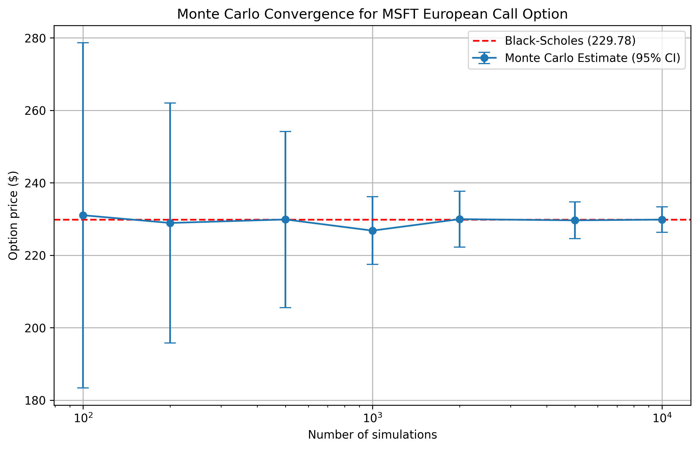

# Computational Finance Projects

A collection of computational finance projects implemented in Python, focusing on simulation-based methods and derivative pricing.

---

# 1. Monte Carlo Stock Price Simulator with Risk Analytics

This project implements a Monte Carlo simulation framework to model possible future price paths of a stock using the Geometric Brownian Motion (GBM) assumption.

It demonstrates practical application of probability modeling, stochastic processes, and numerical simulation in financial analysis.

## Features

* Historical price retrieval using Yahoo Finance API
* Simulation of multiple stochastic price paths
* User-defined inputs
* Risk analytics including:

  * Probability of loss
  * Value at Risk (VaR)
  * Expected Shortfall (ES)
  * Probability of outperforming a benchmark return
* Visualizations:

  * Simulated price trajectory plots
  * Histogram of final price distribution with risk thresholds

*Images represent graphs plotted for stock ticker AAPL, duration 4 years, and 500 simulated paths.*

## Technologies

* Python
* NumPy
* Matplotlib
* yfinance

---

# 2. European Call Option Pricing

This project implements Monte Carlo simulation techniques to price European call options and compares the numerical estimate with the analytical Black-Scholes solution.

It demonstrates practical application of stochastic processes, risk-neutral valuation, and numerical methods in computational finance.

## Features

* Historical stock price retrieval using Yahoo Finance API
* Estimation of annualized volatility from historical log returns
* Monte Carlo simulation of future stock price paths under the Geometric Brownian Motion (GBM) assumption
* Pricing of European call options using discounted expected payoffs
* Black-Scholes analytical pricing for validation and comparison
* Confidence interval estimation for Monte Carlo prices
* Convergence analysis showing how Monte Carlo estimates approach the Black-Scholes price as the number of simulations increases

## Results

*Monte Carlo option price estimates with 95% confidence intervals converging toward the analytical Black-Scholes value as the number of simulations increases.*

## Technologies

* Python
* NumPy
* SciPy
* Matplotlib
* yfinance

---

## Author

**Aradhya Kashyap**
UG Mathematics & Computing

